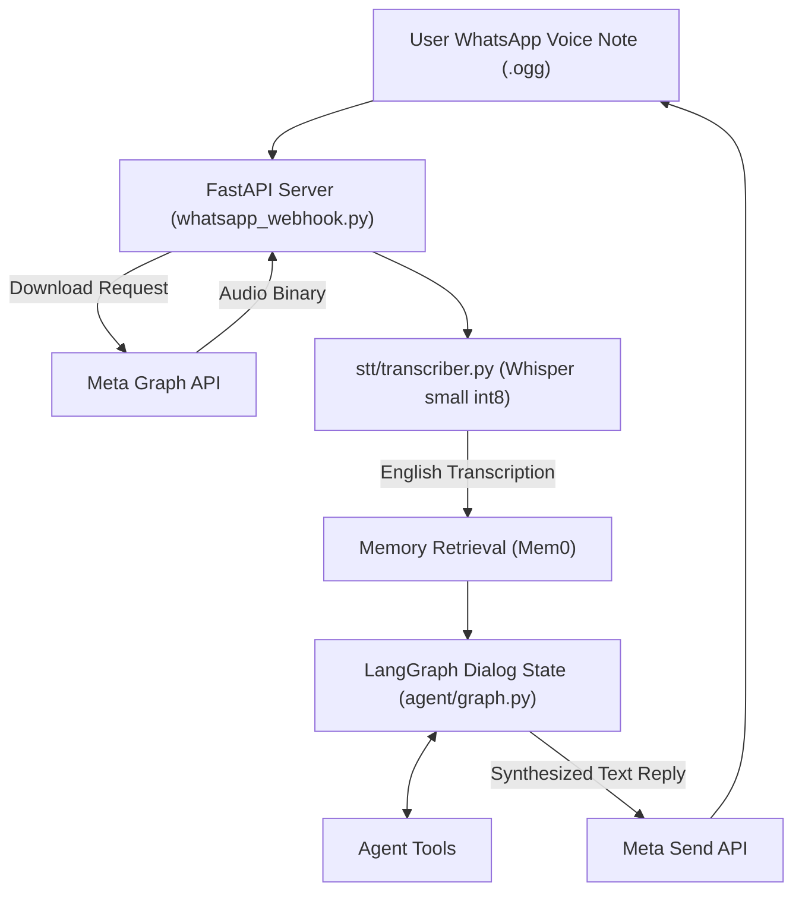
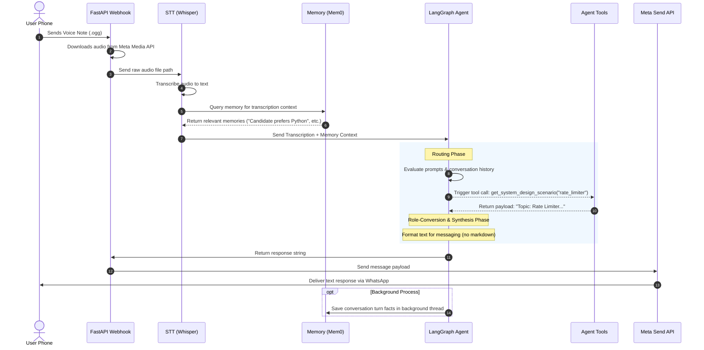

# Julius Voice Agent — System Architecture

This document describes the end-to-end architecture, user journey, data flow, and core technical features of the **Julius Voice Agent**, an asynchronous, voice-to-text, English-speaking mock system design interviewer integrated with the WhatsApp Cloud API.

---

## 🔮 Core Technical Features

Julius is built with a modular, cloud-connected architecture designed for **low latency, offline Speech-to-Text, and persistent long-term memory recollection**:

- **WhatsApp Webhook Channel**: Bypasses local VAD, microphone, and speaker. Receives inbound audio files (voice notes) via Meta's secure WhatsApp HTTP callback, handles verification, and responds asynchronously via WhatsApp text messages.
- **Speech-To-Text (STT)**: Offline local transcription using `faster-whisper` (`small` model quantized to `int8` execution) optimized for low latency and high accuracy in English.
- **Cognitive Reasoning (LangGraph & Groq)**: 
  - Dialog flow managed by `LangGraph` with localized `SQLite` checkpointer state persistence.
  - Hybrid model routing: Uses **Groq Cloud** with `llama-3.3-70b-versatile` (latencies ~600ms) for high-intelligence tool calling and synthesis, with a fallback toggle to local **Ollama** (`llama3.2:3b`).
  - **GenAI System Design Interviewer Prompt**: Configured via a comprehensive 6-step interview workflow (opening, framing, high-level design, deep dive, incident round, and structured rubrics) loaded dynamically from `prompts/interviewer_prompt.txt`.
  - Separated execution prompts: *Routing System Prompt* (first pass for tool routing) and *Synthesis System Prompt* (second pass for natural conversation formatting, ignoring markdown and tools).
  - Role conversion layer: Restructures message schemas sent to Groq during the synthesis pass, mapping tool responses into human-structured messages to prevent API errors.
- **Long-term Memory (Mem0 + ChromaDB)**: Dynamic facts extraction and retrieval via local `Mem0` vector storage, utilizing local `nomic-embed-text` embeddings through Ollama.
- **System Design Tools**:
  - `get_system_design_scenario`: Loads preset system design mock scenarios (Rate Limiter, Chat Service, Ride Hailing, etc.).
  - `save_evaluation`: Commits interview notes, candidate strengths, and scores to a persistent file (`data/evaluations.txt`).
  - `get_time`: Direct local system datetime query (avoids web search hallucination).
  - `search_web`: DuckDuckGo search API fallback for looking up architectural details.

---

## 🔄 End-to-End Data Flow

The following diagram illustrates how user audio inputs sent via WhatsApp flow through the local stack, cognitive layers, and back to the user as text:

---

## 🗺️ User Journey Map

Here is the step-by-step lifecycle of a single interaction turn inside Julius:

---

## 🔒 Configuration & Environment Variables

All critical credentials and execution toggles are isolated into a `.env` file at the project root. Refer to `.env.example` to set up your environment:

- `USE_GROQ`: Toggle between `True` (cloud LLM) and `False` (fully offline Ollama).
- `GROQ_API_KEY`: API Key for low-latency reasoning on Groq Cloud.
- `GROQ_MODEL`: Model name (default: `llama-3.3-70b-versatile`).
- `OLLAMA_BASE_URL`: Local URL for Ollama instances (default: `http://localhost:11434`).
- `LLM_MODEL`: Local Ollama fallback LLM (default: `llama3.2:3b`).
- `EMBEDDING_MODEL`: Local model for memory vector embeddings (default: `nomic-embed-text`).
- `WHATSAPP_TOKEN`: Permanent access token from Meta Developer Portal.
- `WHATSAPP_PHONE_ID`: Phone number ID for sending messages.
- `WEBHOOK_VERIFY_TOKEN`: Verification token matching Meta configuration.
- `MY_WHATSAPP_NUMBER`: Whitelisted phone number allowed to interact with the sandbox.
