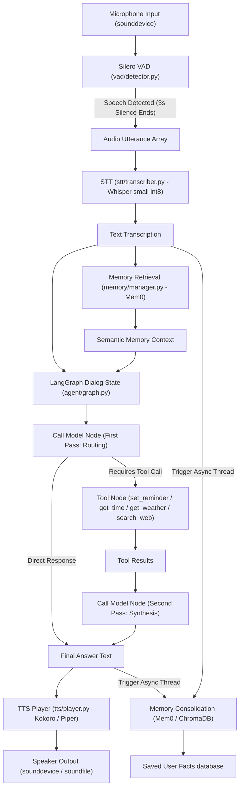
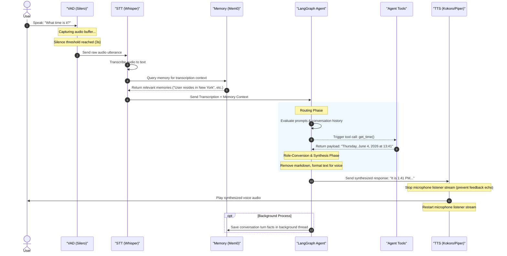

# Julius Voice Agent — System Architecture

This document describes the end-to-end architecture, user journey, data flow, and core technical features of the **Julius Voice Agent**, a low-latency, modular voice assistant designed in English.

---

## 🔮 Core Technical Features

Julius is built with a hybrid edge-cloud stack designed for **zero cost, low latency, offline autonomy, and long-term memory recollection**:

- **Voice Activity Detection (VAD)**: Powering seamless hands-free conversational triggers using *Silero VAD* (running locally on CPU). It tracks sound blocks, saves pre-speech buffer context, and fires after a configured 3-second silence threshold.
- **Speech-To-Text (STT)**: Offline local transcription using `faster-whisper` (`small` model quantized to `int8` CPU execution) optimized for low latency and high accuracy in English.
- **Cognitive Reasoning (LangGraph & Groq)**: 
  - Dialog flow managed by `LangGraph` with localized `SQLite` checkpointer state persistence.
  - Hybrid model routing: Uses **Groq Cloud** with `llama-3.3-70b-versatile` (latencies ~600ms) for high-intelligence tool calling and synthesis, with a fallback toggle to local **Ollama** (`llama3.2:3b`).
  - Separated execution prompts: *Routing System Prompt* (first pass for tool routing) and *Synthesis System Prompt* (second pass for natural conversation formatting, ignoring markdown and tools).
  - Role conversion layer: Restructures message schemas sent to Groq during the synthesis pass, mapping tool responses into human-structured messages to prevent API errors.
- **Long-term Memory (Mem0 + ChromaDB)**: Dynamic facts extraction and retrieval via local `Mem0` vector storage, utilizing local `nomic-embed-text` embeddings through Ollama.
- **Text-To-Speech (TTS)**: Hybrid architecture featuring `Kokoro-ONNX` (high-fidelity neural voice) with a subprocess fallback to `Piper` (high-speed local voice generation in English).
- **Extensible Agent Tools**:
  - `get_time`: Direct local system datetime query (avoids web search hallucination).
  - `get_weather`: Open-source weather metrics fetching.
  - `search_web`: DuckDuckGo search API fallback for recent queries.
  - `set_reminder`: SQLite-backed scheduler recording reminders.

---

## 🔄 End-to-End Data Flow

The following diagram illustrates how user audio inputs flow through the local stack, cognitive layers, and back to audio playback.



### 📱 WhatsApp Webhook Architecture & Data Flow

For the WhatsApp channel, the physical VAD, microphone, and speaker audio layers are bypassed. The flow operates as follows:

```mermaid
graph TD
    UserPhone["User WhatsApp Voice Note (.ogg)"] --> Webhook["FastAPI Server (whatsapp_webhook.py)"]
    Webhook -- "Download Request" --> MetaAPI["Meta Graph API"]
    MetaAPI -- "Audio Binary" --> Webhook
    Webhook --> STT["stt/transcriber.py (Whisper small int8)"]
    STT -- "English Transcription" --> MemorySearch["Memory Retrieval (Mem0)"]
    MemorySearch --> LangGraph["LangGraph Dialog State (agent/graph.py)"]
    LangGraph ◄───► Tools["Agent Tools"]
    LangGraph -- "Synthesized Text Reply" --> MetaSend["Meta Send API"]
    MetaSend --> UserPhone
```

---

## 🗺️ User Journey Map

Here is the step-by-step lifecycle of a single interaction turn inside Julius:



---

## 🔒 Configuration & Environment Variables

All critical credentials and execution toggles are isolated into a `.env` file at the project root. Refer to `.env.example` to set up your environment:

- `USE_GROQ`: Toggle between `True` (cloud LLM) and `False` (fully offline Ollama).
- `GROQ_API_KEY`: API Key for low-latency reasoning on Groq Cloud.
- `GROQ_MODEL`: Model name (default: `llama-3.3-70b-versatile`).
- `OLLAMA_BASE_URL`: Local URL for Ollama instances (default: `http://localhost:11434`).
- `LLM_MODEL`: Local Ollama fallback LLM (default: `llama3.2:3b`).
- `EMBEDDING_MODEL`: Local model for memory vector embeddings (default: `nomic-embed-text`).
